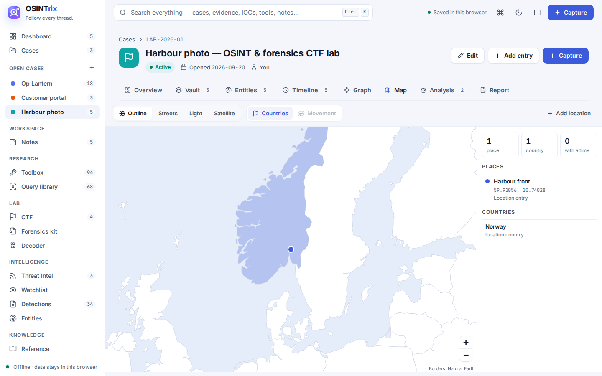
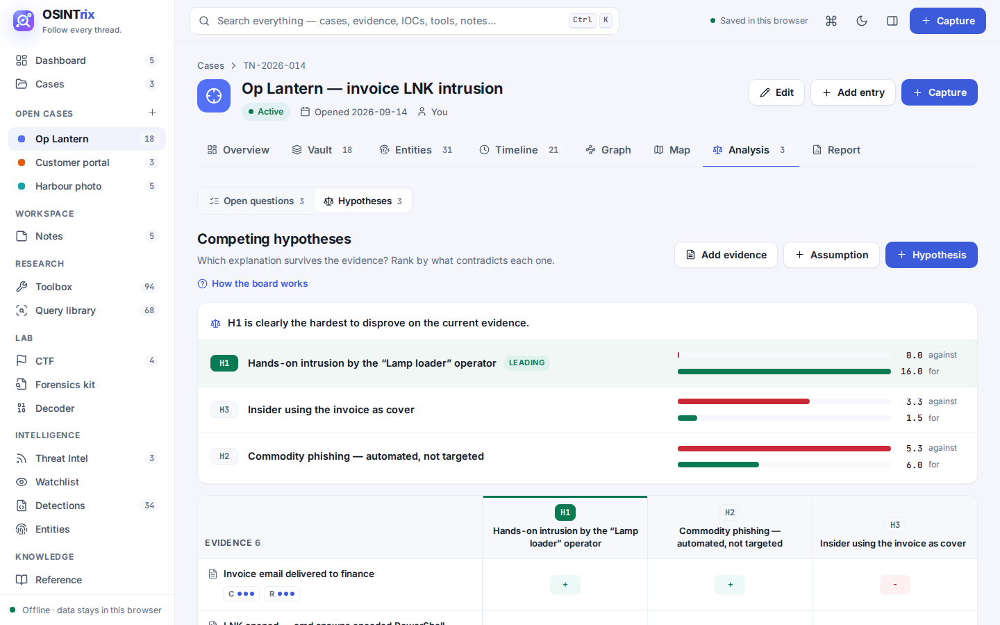
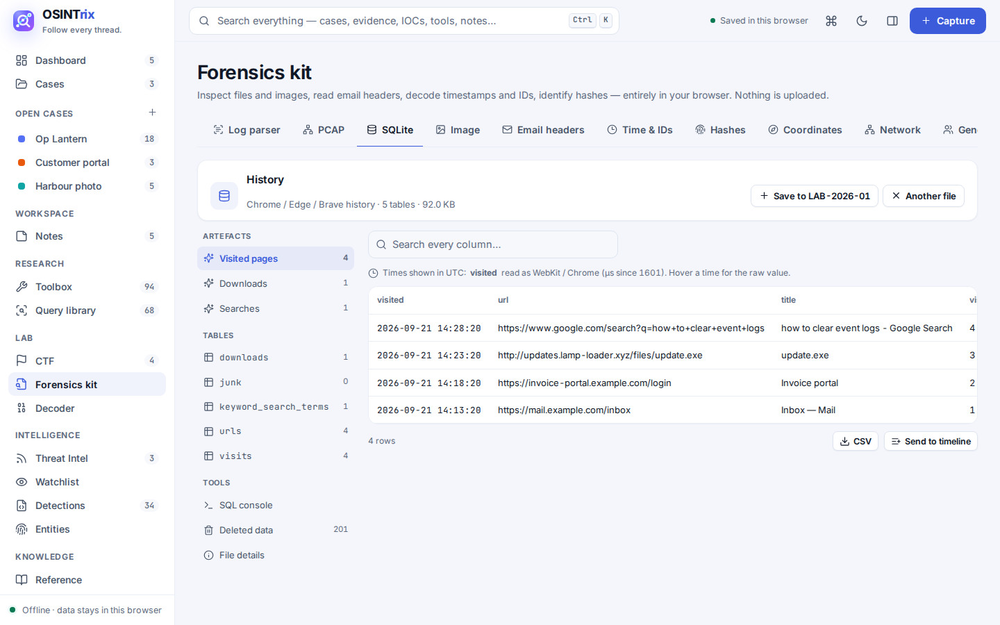

<div align="center">

# OSINTrix

**Follow every thread.**

A private OSINT investigation workspace that runs entirely in your browser.
No server. No account. No tracking. Your cases never leave your machine.

[](https://github.com/YOUR-USERNAME/osintrix/actions/workflows/test.yml)

[**Launch the app →**](https://YOUR-USERNAME.github.io/osintrix/) &nbsp;·&nbsp; [Features](#features) &nbsp;·&nbsp; [Privacy](#privacy-by-design) &nbsp;·&nbsp; [Run it locally](#run-it-locally)


</div>

---

## What is OSINTrix?

OSINTrix is a workspace for OSINT analysts, threat researchers and blue teamers. It brings everything an investigation needs into one place:

- the people, accounts and infrastructure you are tracking;
- the evidence you collect;
- how it all connects;
- the tools and searches you rely on.

It is a plain static site: HTML, CSS and JavaScript files with no framework, no build step and no server code. Open it from GitHub Pages or straight from your disk, and it works the same, offline included. Everything you enter is stored in your browser (IndexedDB) and nowhere else.

## Features

### 🔎 Search everything
Press `Ctrl K` or `/`, or click the search bar, to search the whole app at once: cases, vault entries, evidence, indicators, notes, tools, queries, detection rules, playbooks, CTF challenges, news, pages and actions.
- **Previews:** results are grouped and highlighted, with a preview pane showing fields, evidence text, rule code, playbook steps or lookup links.
- **Typo-tolerant:** `shdoan` still finds Shodan.
- **Syntax:**
  - `in:tools` (or any other area) searches one area;
  - `case:TN-2026-014` searches one case;
  - `"exact phrase"` matches a phrase, and `-word` excludes one;
  - `host:` / `verdict:` / `after:` offer to filter the case timeline.
- **Indicators:** paste an IP, domain, hash or email to see everywhere it appears, its verdict, and one-click lookups.
- **Keyboard:** recent searches are remembered, `Tab` moves to the next area, and the arrow keys and `Enter` pick a result.


### 🗂️ Cases
- **Case vaults:** each investigation holds typed entries (people, usernames, emails, phones, domains, IPs, crypto wallets, forums, documents and more). Each type has its own fields, plus priority, verdict, tags and notes.
- **Evidence capture:** choose the case it goes to, then paste a log line, a post, a WHOIS record or a whole report. Indicators and timestamps are pulled out automatically: IPv4/IPv6, domains, URLs, emails (including `[at]`/`[dot]` obfuscation), @handles and usernames, social-profile links for 25 platforms, phone numbers, BTC/ETH/XMR/LTC/TRX/DOGE wallets, IBANs, MD5 to SHA-512, MAC addresses, ASNs, coordinates, CVEs and ATT&CK technique IDs.
  - **Log parsing:** JSON, CEF, LEEF, Windows event XML, Apache/Nginx, IIS/W3C, Zeek, Cisco ASA, sshd/sudo, key=value (FortiGate, Sysmon, iptables…) and syslog headers. Fields are mapped to common names (src.ip, dst.port, user, action, url…) for filters like `dst.port:443`, for Sigma, and for graph relations. Records get readable titles such as “TCP 10.0.0.8:51000 → 93.184.216.34:443 · deny — FortiGate”.
  - **Your own parsers:** Forensics kit → Log parser drafts a regex from a sample line. You name the groups, and it runs before the built-ins. You can also map vendor field names to common ones.
  - **Before you save,** every indicator is checked against all your cases, your verdicts, your watchlist and the offline context lists (cloud provider, Tor exit, disposable email, dynamic DNS, URL shortener, paste site, phone country).
  - **Saved web pages:** drop an `.html` or `.mhtml` page you saved with the browser. Its URL, title, author, dates, text, outbound links and email links are archived as evidence with the file's SHA-256. The original opens in a sandbox with scripts off.
  - **Screenshots and files:** paste or drop them in. Each is hashed (SHA-256), stored in the browser and shown with a preview on its record.
  - **Log import:** CSV, TSV, JSON or NDJSON exports (Sysmon, firewall, proxy, EDR…). Pick the time, title and host columns; each row becomes a record, with every column kept so detections can test it.
- **Entities per case:** every indicator in the case, with first and last seen, record counts and which other cases share it. Filter by kind or verdict, then set verdicts, add to the vault or export in bulk.
- **Timeline:** every record in order, with day headers, event markers and filters. Search with `host:`, `verdict:`, `type:`, `tag:`, `after:` and `before:`.
  - **Activity heatmap** (day × hour): click a cell to see just that hour.
  - **Multi-select:** tag, mark as key evidence, export to CSV or delete many records at once.
- **Case map:** a pan-and-zoom map (Leaflet) with every place in the case. Points come from Location entries, coordinates in evidence and photo GPS. Countries are shaded from country fields, phone country codes and log fields. A numbered movement path shows legs in time order, with distance, time and speed, and flags impossible travel. The default outline map works offline. Street and light maps (CARTO) and satellite imagery (Esri) load tiles only after you agree, because those servers see the area you view. If tiles can't be loaded (offline, or blocked on your network), the map says so and falls back to the outline map.
- **Hypothesis board (Analysis tab):** analysis of competing hypotheses. List the explanations, rate every piece of evidence against each (++ + · – ––), weighted by credibility and relevance. Hypotheses are ranked by how much evidence *contradicts* them. Non-diagnostic evidence and evidence that alone decides the ranking are flagged. The ranking goes into the report.
- **Link graph:**
  - **Not on the graph yet?** The graph shows vault entries. It tells you how many entities from the evidence are missing, and **Add from evidence** lets you tick exactly which ones to add.
  - **Build from evidence:** entities in your records become nodes. Relations the evidence *states* become links, with the reason attached. That covers URL→domain, email→domain, profile→handle, DNS answers, Sysmon connections, email From/To/Reply-To, WHOIS registrant and name servers, and phrases like “resolves to”, “beacons to” or “aka”. Filters skip private IPs, benign entities and one-off mentions. You can turn it on per case so every new capture is added automatically.
  - **Suggested links:** pairs that appear together in the evidence, that happen within two minutes on the same host, look-alike usernames across platforms, and shared IPs or registrants. Each comes with a reason, and you accept or dismiss it.
  - **Expand from evidence:** right-click a node to bring in everything its records mention.
  - **Insights:** hubs, bridges (betweenness), clusters with colouring, and “look at next” — unrated entities touching malicious ones.
  - Drag, add, edit and connect nodes.
  - Right-click menus on nodes, links and empty canvas.
  - Every relationship carries a confidence rating and its evidence.
  - **Shortest path** between any two entries.
  - **"As of" time slider** that replays how the picture grew.
  - Automatic layouts, and export as PNG, GraphML (Gephi, yEd, Maltego) or CSV.
- **Questions and playbooks:** track what you still don't know, or run a playbook (phishing triage, username OSINT, domain & infrastructure, malware triage, crypto tracing, IR first hour…) and every step becomes an open question.
- **Reports and exports:**
  - A cited report with four templates (full, executive, technical, CTF write-up), a relationship map, and a **redact** switch that masks emails, phones, IPs, handles and names. Print it, save it as PDF, or export it as Markdown.
  - Every indicator as CSV, a defanged text list, or a STIX 2.1 bundle.
  - A whole case as JSON, which a colleague can import on their own machine.
- **Research checklist:** every lookup for an indicator is a checklist. It ticks itself when you open a site, shows how far you got, and offers “Open next”. Progress also shows on the case Entities tab.
- **One-click pivots:** every IP, domain, URL, email, hash, wallet, handle and CVE has lookup buttons for VirusTotal, AbuseIPDB, Shodan, urlscan, crt.sh, HIBP, Etherscan, NVD and more. Each opens in a new tab; nothing is fetched by OSINTrix.






### 🧰 Research
- **Toolbox:** 90+ curated OSINT and security tools across 8 categories.
  - Favourites, a quick-launch list, tags and bulk actions.
  - Card, directory and compact layouts.
  - Import your own tool list.
  - **Your own lookups:** give any tool a URL template such as `https://example.com/search?q={value}`. It then appears in the lookup buttons for the matching IPs, domains, emails or hashes, and gets a Run button.
- **Query library:** 68 saved search recipes with `{{BLANKS}}` that fill from your case entries.
  - Runs in Google, Bing, DuckDuckGo, Shodan, Censys, GitHub, ZoomEye, FOFA and Intelligence X.
  - Each search can be logged to the case.
- **Reference:** Windows and Sysmon event IDs, ports, and living-off-the-land binaries.


### 🧪 Lab (CTFs, forensics, OSINT challenges)
- **CTF tracker:** events with their own flag format, and challenges on a board (to do, working, solved).
  - Each challenge has points, category, flag, notes and a linked case.
  - A progress bar per category, and write-ups exported as Markdown.
- **Flag finder:** flag-shaped strings (`FLAG{…}`, `picoCTF{…}`, `HTB{…}`, or your event's own format) are picked out automatically in the Decoder and File inspector, and saved to a challenge with one click.
- **File inspector:** drop in any file; it is read locally and never uploaded. It shows:
  - the true file type from its magic bytes, with a warning when the extension lies;
  - MD5, SHA-1 and SHA-256, and entropy;
  - EXIF metadata, including GPS converted to decimal with map links; PNG text chunks; C2PA content credentials;
  - **Office files:** author, dates and app from the metadata, VBA macros, embedded OLE objects and remote template links;
  - **PDF:** document info and XMP, JavaScript, auto-actions, launch actions, embedded files, links and incremental updates;
  - **ZIP:** the full file list, encrypted entries and dates;
  - **Windows PE and Linux ELF:** architecture, compile time, sections with entropy, imports, suspicious APIs and packer hints;
  - data appended after the end of the file, and embedded file signatures (a lightweight binwalk);
  - strings (ASCII and UTF-16) with compressed noise filtered out, indicators found in them, and a hex dump;
  - a **YARA scan** with your own rules.
  Save the findings to a case in one click.
- **PCAP reader:** open a .pcap or .pcapng file (Wireshark, tcpdump, firewall exports). It shows:
  - conversations, hosts with MAC addresses and names, and protocol counts;
  - DNS lookups and answers, DHCP hostnames, HTTP requests with downloadable files, and TLS server names (SNI), versions, ALPN and JA3 fingerprints;
  - cleartext logins (HTTP Basic and forms, FTP, POP3, IMAP, SMTP AUTH, SNMP communities);
  - findings: beacons, port scans, ARP spoofing, DNS tunnelling, programs downloaded over HTTP and malware-typical ports;
  - a follow-stream view in text or hex.
  Encrypted traffic (HTTPS, SSH, QUIC) stays encrypted, but who talked to whom, when and how much is still shown. Send the events to a case timeline in one click.
- **SQLite viewer:** open any SQLite database. It recognises Chrome / Edge / Brave history, downloads, searches, cookies, saved logins and autofill; Firefox history, bookmarks, cookies and form history; Safari history; Android SMS and call logs; iPhone messages; and WhatsApp. Time columns are decoded (Unix, WebKit, PRTime, Apple, FILETIME). Free pages are scanned for text left over from deleted rows. There's a read-only SQL console and CSV export, and rows can be sent to a case timeline. Passwords and encrypted cookies are never decrypted.
- **Image tools:** colour channels, bit planes 0–7, LSB text extraction, QR code decoding, **error level analysis (ELA)**, a perceptual fingerprint that finds the same photo among your evidence even after resizing, and one-click reverse image search sites.
- **Email headers:** paste raw headers to see SPF, DKIM and DMARC results, From / Reply-To / Return-Path mismatches, the hop path with delays, and the sender's first public IP.
- **Timestamps and IDs:** paste a number and see it as Unix (seconds, ms, µs, ns), Windows FILETIME / LDAP, Chrome / WebKit, Cocoa, HFS+, GPS and DOS time, with the most likely reading flagged. Paste a post or profile ID (X, Discord, TikTok, Instagram, Mastodon, LinkedIn), a MongoDB ObjectId, UUID v1/v7, ULID or KSUID to get the time it was created.
- **Network:** subnet calculator (IPv4 and IPv6), MAC address vendor lookup from the bundled IEEE list, and a user-agent parser that flags scripts and bots.
- **Username and email generator:** likely handles and addresses from a person's name, ready to check.
- **Hash identifier:** MD5 / NTLM, SHA family, bcrypt, the Unix crypt formats, NetNTLMv1 and v2, Kerberoast / AS-REP, JWT and more, each with its hashcat mode.
- **Coordinates:** reads decimal degrees, DMS or a Google Maps link, and converts between formats. Links to Google Maps, Street View, OpenStreetMap, Google Earth, Bing and Mapillary.
- **Decoder:** 25 operations. Beyond the basics there are Base32, Base58, binary, character codes, `\x` / `\u` unescaping, all 25 Caesar shifts, single-byte XOR brute force, Morse and gunzip / inflate.




### 🛡️ Intelligence
- **Watchlist:** watch any indicator. New evidence, log imports and news that mention it are flagged, with a notice, a Dashboard card and a list of sightings.
- **Around this time:** every record shows what else happened within ±5 minutes, on any host, one click from a filtered timeline.
- **Detections:** write, keep and import Sigma and YARA rules.
  - Editor with syntax highlighting and a live structure check.
  - **Test a rule** against a case's evidence (Sigma and YARA) or against a file (YARA). The engines are subsets that run in the page; anything they cannot evaluate is reported, never silently passed.
  - Link a rule to a case, or generate starter rules from a case's malicious indicators.
- **Threat Intel:** security news from your RSS sources, classified by category and severity, and checked against every entity in your cases. It is off until you turn it on.
- **Entities:** every indicator across every case, with verdicts and cross-case matches. Filter by case.


### 📝 And also
- Sticky notes and to-dos, general or pinned to a case.
- A command palette (`Ctrl K`) for searching everything and running actions.
- Light (default) and dark themes, three text sizes, and a compact density.
- Fully responsive: sidebar on desktop, icon rail on tablet, and a bottom bar with sheets on phones.

<p align="center"></p>

## Security and chain of custody

- **Encrypted workspace:** AES-256-GCM with a key from your passphrase (PBKDF2-SHA-256, 310,000 rounds). It covers cases, notes, restore points and attached files, and can auto-lock when idle. The passphrase is never stored.
- **Encrypted backups and case exports:** these use a passphrase of their own. Importing asks for it.
- **Tamper-evident audit log:** every change is chained by hash, and Verify shows exactly where a chain was edited.
- **Signed chain-of-custody reports:** every record of a case with its SHA-256, capture time and files, plus the audit chain, signed with the workspace's ECDSA P-256 key. Anyone can verify one in the app.

## Privacy by design

| | |
|---|---|
| **Where your data lives** | Only in this browser (IndexedDB, with a localStorage copy). Nothing is uploaded. There is no backend and no analytics. |
| **Network access** | The page's Content Security Policy blocks every outside connection except two, both opt-in: `api.rss2json.com` if you turn on live Threat Intel feeds (only feed addresses are sent), and map tiles from CARTO or Esri if you pick the streets, light or satellite map (the tile server sees the area you view, never your case). The default outline map, the PCAP reader and the SQLite viewer work fully offline. |
| **Untrusted content** | Feed articles and pasted evidence are shown as plain text. Links open only when you click them, in a new tab with no referrer. |
| **Storage** | Saved in **IndexedDB**, with a localStorage copy while it fits. Every change is written within about 250 ms, and again when you switch tabs or close the page. Room depends on the browser and free disk space: usually hundreds of MB or more, compared with roughly 5 MB for localStorage alone. Help shows how much you are using. |
| **One browser, one address** | Data belongs to one browser profile *and* one address. A copy opened from disk (`file://`) and the GitHub Pages copy each keep their own data, and so do Chrome and Firefox. Private windows and embedded previews keep nothing; a red banner warns you when saving is blocked. |
| **Backups** | Clearing site data erases everything. Export regularly from **Help → Export everything** (attached files are included); the same page imports a backup. The Dashboard reminds you when your last backup is more than two weeks old. |
| **Encryption** | Optional. Everything the browser stores is sealed with AES-256-GCM, and the app opens locked. |
| **Undo, trash and restore points** | Deleted cases, entries, records, relationships and notes stay in the trash for 30 days. A full restore point is saved before every import, reset, sample-data removal or log import. |
| **Sample data** | The app starts with three example investigations, notes, news items and CTF challenges. **Remove sample data** (on the Dashboard banner, Settings or Help) deletes only those and keeps your own work. |

## Run it locally

No install, no build step, no dependencies.

```bash
git clone https://github.com/YOUR-USERNAME/osintrix.git
cd osintrix
# then open index.html in any modern browser
```

Everything is plain files, so you edit them and reload the page. The scripts are ordinary `<script>` tags loaded in order, which is why it also works when opened straight from disk (`file://`), where ES modules and `fetch()` are blocked.

```
osintrix/
├── index.html              ← page skeleton, Content Security Policy, script order
├── css/
│   ├── app.css             ← design system and every component
│   └── fonts.css           ← @font-face rules
├── fonts/                  ← Inter and JetBrains Mono (woff2)
├── js/
│   ├── data/
│   │   ├── tools.js            ← default toolbox (JSON after the "=")
│   │   ├── query-templates.js  ← default query library
│   │   └── detection-rules.js  ← default Sigma / YARA rules
│   ├── vendor/             ← cytoscape, Leaflet, world outlines, sql.js (loaded on demand), jsQR, IEEE MAC vendors, offline context lists
│   ├── icons.js            ← Lucide icon set
│   ├── engine.js           ← indicator extraction, time parsing, search syntax
│   ├── brand.js · model.js · demo.js   ← name and logo, entry types, sample cases
│   ├── core.js             ← state, storage (IndexedDB), routing
│   ├── views.js            ← dashboard, cases, timeline
│   ├── graph.js            ← Cytoscape graph, paths, time slider, exports
│   ├── areas.js            ← toolbox, entities, decoder, reference, settings, help
│   ├── insp.js             ← details panel, dialogs, capture
│   ├── intel.js · queries.js · detections.js · notes.js · playbooks.js
│   ├── extras.js           ← pivots, IOC export, print, case import, decoder
│   ├── lab.js · kit.js     ← CTF tracker, forensics kit, file parsers, YARA / Sigma engines
│   ├── search.js           ← search everything
│   ├── safety.js           ← trash, restore points, backups, attachments, log import
│   ├── tl.js · report.js   ← timeline heatmap and multi-select, report templates
│   ├── caseents.js         ← the Entities tab inside each case
│   ├── map.js · ach.js     ← case map, hypothesis board
│   ├── pcap.js · sqlite.js ← packet capture reader, SQLite viewer
│   ├── validate.js         ← form checks, duplicate names
│   ├── security.js         ← encryption, audit chain, signed custody reports
│   ├── webpage.js · imgx.js ← saved web pages, ELA and image fingerprints
│   ├── parse.js            ← log parser: formats, field names, your own parsers
│   ├── relate.js           ← build the graph from evidence, suggested links, expand, insights
│   ├── watch.js            ← offline enrichment, watchlist, “around this time”
│   └── app.js              ← events, keyboard, boot (loads last)
├── tools/bundle.py         ← optional: makes a one-file offline copy
├── tests/                  ← Playwright end-to-end tests (npm test), run on every push by GitHub Actions
├── .github/workflows/      ← CI
└── docs/                   ← screenshots
```

### Tests

```bash
npm install
npx playwright install chromium
npm test
```

The tests open the real app from disk and check that:

- every screen draws;
- extraction and log parsing work;
- graph relations are built from evidence;
- encryption locks and unlocks;
- the audit chain catches edits, and custody reports catch tampering;
- saved web pages never run scripts;
- photo GPS lands on the map;
- the hypothesis board ranks by evidence against;
- a packet capture yields its DNS, HTTP, TLS server names and JA3, cleartext logins and beacon findings (pcap and pcapng);
- a Chrome history database opens with decoded times, recovered deleted text and a SQL console that cannot change it;
- forms show inline errors and refuse duplicate names, and copies are numbered;
- every control can be clicked without an error.

GitHub Actions runs them on every push.

### One-file offline copy (optional)

For emailing to a colleague, a USB stick or an air-gapped machine:

```bash
python tools/bundle.py      # Python 3, standard library only → dist/osintrix-offline.html
```

It inlines every file above into one HTML page. It is the same app, and it keeps its data in the same place.

### Adding default tools

Add entries to `js/data/tools.js` and reload. When people load the new version, the new tools are added to their toolbox automatically. Their own tools, favourites and pins are left alone, and pre-added tools they deleted stay deleted.

## Keyboard shortcuts

| Keys | Action |
|---|---|
| `Ctrl` `K` or `/` | Search everything, run actions |
| `N` | Capture evidence |
| `E` | Add a vault entry |
| `1` – `7` | Switch case tabs |
| `Ctrl` `S` | Save the rule you're editing |
| `Ctrl` `Enter` | Save a capture or note |
| `Shift` `F10` | Graph menu for the selected node |
| `Esc` | Close a panel or dialog |

## Roadmap

- [x] Playbooks: investigation checklists that run on a case
- [x] Case import and export, IOC export (CSV, text, STIX 2.1), print to PDF
- [x] CTF tracker, forensics kit, flag finder
- [x] IndexedDB storage (well beyond the ~5 MB localStorage limit)
- [x] Optional encrypted backup files
- [x] PCAP reader (conversations, DNS, HTTP, TLS, cleartext logins) and SQLite / browser-history viewer
- [ ] Crypto-currency tracing (needs a blockchain API)
- [ ] Library: a personal knowledge base of articles and write-ups
- [x] Evidence attachments (screenshots, files) stored locally
- [x] Bulk log import, report templates and redaction, trash and restore points

## Built with

Vanilla JavaScript and CSS, with no framework. Everything is bundled so it runs offline:

| Component | License |
|---|---|
| [Cytoscape.js](https://js.cytoscape.org/) 3.30 | MIT |
| [Inter](https://rsms.me/inter/) | SIL Open Font License 1.1 |
| [JetBrains Mono](https://www.jetbrains.com/lp/mono/) | SIL Open Font License 1.1 |
| [Lucide](https://lucide.dev/) icons | ISC |
| [jsQR](https://github.com/cozmo/jsQR) 1.4 | Apache-2.0 |
| IEEE OUI list via [oui-data](https://github.com/silverwind/oui-data) | BSD-2-Clause |
| [Leaflet](https://leafletjs.com/) 1.9 | BSD-2-Clause |
| [sql.js](https://sql.js.org/) 1.13 (SQLite in WebAssembly, loaded only when the SQLite viewer opens) | MIT |
| [Natural Earth](https://www.naturalearthdata.com/) country outlines via world-atlas | Public domain / ISC |
| Cloud IPv4 ranges via [lord-alfred/ipranges](https://github.com/lord-alfred/ipranges) | CC0-1.0 |
| Tor exit nodes via [SecOps-Institute/Tor-IP-Addresses](https://github.com/SecOps-Institute/Tor-IP-Addresses) | public Tor Project data |
| [disposable-email-domains](https://github.com/disposable-email-domains/disposable-email-domains) | CC0-1.0 |

The demo case data is synthetic. The IPs and domains in it use reserved documentation ranges such as `203.0.113.0/24` and `.example`.

## Background

OSINTrix merges two of my college projects: **ThreatNet**, a toolbox and knowledge vault for security research, and **Clew**, a timeline-based investigation notebook. Together they became one privacy-first workspace. The change history is in [CHANGELOG.md](CHANGELOG.md).

## Disclaimer

OSINTrix is for lawful research, security operations and education. You are responsible for how you use it and for following the terms of any third-party site or tool you reach through it.

## License

<!-- Pick one and add a LICENSE file, e.g. MIT: https://choosealicense.com/licenses/mit/ -->
Not yet licensed. All rights reserved until a LICENSE file is added.
